# Project 3: Use Deep Learning to Clone Driving Behavior

## Behavioral Cloning Project

##### The goals / steps of this project are the following:

- Use the simulator to collect data of good driving behavior
- Build, a convolution neural network in Keras that predicts steering angles from images
- Train and validate the model with a training and validation set
- Test that the model successfully drives around track one without leaving the road
- Summarize the results with a written report

### Files Submitted & Code Quality

#### 1. Submission includes all required files and can be used to run the simulator in autonomous mode

My project includes the following files:

- `model.py`: containing the script to create and train the model
- `drive.py`: for driving the car in autonomous mode
- `image_augmentation_helper.py`: for generating augmented data
- `model.h5`: containing a trained convolution neural network
- `writeup_report.md`: this is summarizing the results that you're reading now
- `final_video.mp4`: video of successful lap around track 1

#### 2. Submission includes functional code Using the Udacity provided simulator and my drive.py file, the car can be driven autonomously around the track by executing

`python drive.py model.h5`

#### 3. Submission code is usable and readable

- `model.py` contains the code for training and saving the convolution neural network. It is based off of the nvidia model.
- `image_augmentation_helper.py` contains the code for generating augmented images. It was easier to maintain to break out into separate files.

I'll explain more about the model and image augmentation in the following sections.

### Model Architecture and Training Strategy

#### 1. An appropriate model architecture has been employed

My model is based on the nvidia model with some modifications. It consists of a convolution neural network with 3x3 and 5x5 filter sizes and depths between 24 and 64 (model.py lines 83-87)

The model includes ELU/RELU layers to introduce nonlinearity (model.py lines 83-87), strides of 2x2 and 1x1 and the data is cropped, resized and normalized using a Keras lambda layer in the model (model.py lines 80-82). 

**Cropping:**
I tried different crop values, but decided to crop the bottom area containing the hood and the top containing the trees and sky. I also cropped some off the sides, but I didn't see much difference since it was minimal cropping of the left and right sides. I finally went with cropping the bottom 25, top 70 and 5 pixels off the left and right sides. 

**Resizing:**
I resized the model initially as (66,200), (66,260), (133, 260) and settled on (64,64). My decision was to reduce the total number of overall parameters since 300k is much easier to train and 1.5 million along with the number of images generated. 

**Normalization:**
Lastly, I used one of the mentioned ways from lecture to normalize. Overall, I've found that there is little difference no matter which option is used for images. That is based on the previous projects where we've had to normalize data. For this project, it was also true.

#### 2. Attempts to reduce overfitting in the model

The model contains dropout layers in order to reduce overfitting (model.py lines 88,90,92,94). I think the dropout I added for lines 88 and 90 might be somewhat redundant, but I decided to keep it based on my test runs.

The model was trained and validated on the Udacity data set to ensure that the model was not overfitting (model.py lines 104-106). The model was tested by running it through the simulator and ensuring that the vehicle could stay on the track. I also added the ModelCheckpoint callback to save the weights after each epoch so it was available if the training and validation mse were in line with each other. Then I could use these to see the performance of the model in addition to the final model weights.

#### 3. Model parameter tuning

The model used an adam optimizer with a learning rate of 0.0001 and a 'mean_squared_error' loss function (model.py line 99-100) running for 10 epochs with more than 80k samples. 

#### 4. Appropriate training data

I spent about two weeks just on generating training data. Given the Udacity data set was skewed, I made a lot of effort to come up with what I hope was unique ways to easily generate additional data. I know more data is generally helpful depending on bias/variance tradeoff, but the more data will take longer to run. I found AWS was slower than I expected where it was probably about 2x faster at best where I would have expected 5x or more so I eventually decided to just run locally. That was a huge disadvantage for this project and timeliness. So the amount of data impeded the turnaround time to get results. With that said, I used center images filtering out samples with steering angles less than 0.1, left steering angles greater than 0.25 and right steering angles less than -0.25. My reasoning for the left and right steering angles were to capture what would look like recovery data to the CNN. For left steering angles, I had to adjust it by adding a small correction value like 0.25. So if the value is greater than 0.25, it will be includes as recovery data since it is moving towards the center. Likewise since the right steering angle data, 0.25 is subtracted, then samples less than 0.25 will also be recovery data moving towards center. My goal was to use the Udacity data only.

For details about how I created the training data, see the next section.

### Architecture and Training Documentation

#### 1. Solution Design Approach

The overall strategy for deriving a model architecture was to start with known working models like nvidia and comma.ai. Given that the nvidia model was road-tested in the real world, I focussed most of my time on this model.

To determine how well the model was working, I split my image and steering angle data into a (80%) training and (20%) validation set (model.py line 68).

After about 400-500 epochs from runs using different network architectural tweaks, I finalized in this model. To reduce or minimize overfitting, I added dropouts via trial and error (model.py lines 88,90,92,94).

To improve the performance of the model, I added a few methods to extract left and right recovery data as mentioned earlier (image_augmentation_helper.py lines 179-191)

One issue I faced is that my i5 laptop was not fast enough during simulation so many of my runs could have possibly been valid (very minimal overfitting and low mean squared error (less than 0.01 on training/validation data) with given architectures tested. Running the simulator at 400x300 allowed me to finally get a successful track run.

Finally after working through my issues, the vehicle is able to drive autonomously around the track without leaving the road.

#### 2. Final Model Architecture

The final model architecture (model.py lines 78-97) consisted of a convolution neural network with the following layers and layer sizes. I tried many times with the nvidia and comma.ai models. This model resembles nvidia with resized pictures 64x64 instead of 66x200. This greatly reduced the parameters from 1.5 million to 300k parameters. 

Layer (type) | Output Shape | Param # | Connected to 
--- | --- | --- | ---
cropping2d_12 (Cropping2D) | (None, 65, 310, 3) | 0 | cropping2d_input_12[0][0]     
lambda_48 (Lambda) | (None, 64, 64, 3) | 0 | cropping2d_12[0][0]    
lambda_49 (Lambda) | (None, 64, 64, 3) | 0 | lambda_48[0][0]          
convolution2d_6 (Convolution2D) | (None, 30, 30, 24) | 1824 | lambda_49[0][0]             
convolution2d_7 (Convolution2D) | (None, 13, 13, 36) | 21636 | convolution2d_6[0][0]         
convolution2d_8 (Convolution2D) | (None, 5, 5, 48) | 43248 | convolution2d_7[0][0]        
convolution2d_9 (Convolution2D) | (None, 3, 3, 64) | 27712 | convolution2d_8[0][0]       
convolution2d_10 (Convolution2D) | (None, 1, 1, 64) | 36928 | convolution2d_9[0][0]         
dropout_1 (Dropout) | (None, 1, 1, 64) | 0 | convolution2d_10[0][0]         
flatten_1 (Flatten) | (None, 64) | 0 | dropout_1[0][0]             
dropout_2 (Dropout) | (None, 64) | 0 | flatten_1[0][0]             
dense_1 (Dense) | (None, 1164) | 75660 | dropout_2[0][0]             
dropout_3 (Dropout) | (None, 1164) | 0 | dense_1[0][0]            
dense_2 (Dense) | (None, 100) | 116500 | dropout_3[0][0]             
dropout_4 (Dropout) | (None, 100) | 0 | dense_2[0][0]            
dense_3 (Dense) | (None, 50) | 5050 | dropout_4[0][0]              
dense_4 (Dense) | (None, 10) | 510 | dense_3[0][0]                
dense_5 (Dense) | (None, 1) | 11 | dense_4[0][0]                  

#### 3. Creation of the Training Set & Training Process

Because I wasn't able to capture data easily and had the option of using the data from Udacity, I decided to make use of the Udacity data and manipulate the data however I needed. As can be seen by the histogram, the data is very biased with a steering angle of 0.0 since the majority of the track is straight. 
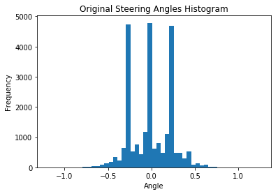

Given the Udacity data, I attempted to augment the data in a variety of ways. My objective was to learn more about OpenCv at the same time. As I mentioned earlier, this took considerable time but I realized how much more there is to learn about computer vision so that's pretty exciting. I chose the following ways to augment the data below. I saw that many students used Vivek Yadav's methods from his [post](https://chatbotslife.com/using-augmentation-to-mimic-human-driving-496b569760a9). I think Vivek is brilliant in his approach, but I felt copying his methods would lesson the experience for this project (although it was a disadvantage to getting this project submitted on time so in retrospect it might have been a bad choice). I attempted to simulate different climate conditions (simplistic RGB view I think). I did not experiment too much with color spaces but I think that this would have helped tremendously as tensorflow has a nice method to convert rgb to hsv. I found this [link](https://dsp.stackexchange.com/questions/2687/why-do-we-use-the-hsv-colour-space-so-often-in-vision-and-image-processing) that helps explain the advantages of using hsv over rgb color space in computer vision. Some of the main advantages is the conversion is much easier to go between, separates the luma from chroma and "robustness to lighting changes or removing shadows". 

I chose six different effects overall and applied them to the Udacity data set.

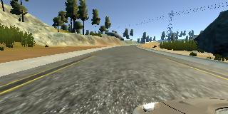

The first two are simple image thresholding where if pixel value is greater than the thresholded value, it is assigned one value, otherwise it is assigned another value. While the picture is supposed to be grey scale, I did not do this.

[**Binary:**](http://docs.opencv.org/3.0-beta/doc/py_tutorials/py_imgproc/py_thresholding/py_thresholding.html#thresholding)
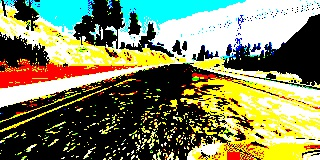
[**To Zero Inverse:**](http://docs.opencv.org/3.0-beta/doc/py_tutorials/py_imgproc/py_thresholding/py_thresholding.html#thresholding)
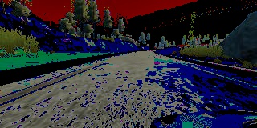
[**Truncated:**](http://docs.opencv.org/3.0-beta/doc/py_tutorials/py_imgproc/py_thresholding/py_thresholding.html#thresholding)
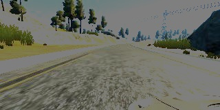

I created two methods for each where one is the threshold method and one which generates an entry into my list containing the name of the file and steering angle (image_augmentation_helper.py, method names see below).

`
- def binary_threshold_image()
- def generate_binary_data()
- def tozero_inv_threshold_image()
- def generate_tozero_inv_data()
- def truncate_threshold_image()
- def generate_truncated_data()
`

Blurring is a way to smooth the image by removing high frequency content such as noise and edges from the image which causes the image to be slightly blurred.
[**Blur:**](http://docs.opencv.org/3.0-beta/doc/py_tutorials/py_imgproc/py_filtering/py_filtering.html#filtering)
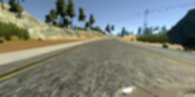

Like above, I created a method where one is the smoothing method and one which generates an entry into my list containing the name of the file and steering angle (image_augmentation_helper.py, method names see below).

`
- def blur_image()
- def generate_blur_data()
`

The next two are morphological transformations where erosion discards pixels based on the boundary depending on the size of the kernel. Morphing is the result of the difference between dilation and erosion where dilation is the opposite of erosion.
[**Erode:**](http://docs.opencv.org/3.0-beta/doc/py_tutorials/py_imgproc/py_morphological_ops/py_morphological_ops.html#morphological-ops)
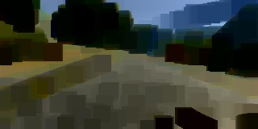
[**Morph:**](http://docs.opencv.org/3.0-beta/doc/py_tutorials/py_imgproc/py_morphological_ops/py_morphological_ops.html#morphological-ops)
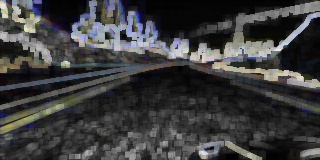 

Finally, I created a method where one is the transformation method and one which generates an entry into my list containing the name of the file and steering angle (image_augmentation_helper.py, method names see below).

`
- def erode_image()
- def generate_erode_data()
- def morph_gradient_image()
- def generate_morph_data()
`

Lastly, I took the original Udacity data and generated augmented data and flipped it (image_augmentation_helper.py, method names see below). This results in over 100k of images.
[**Flip:**](http://docs.opencv.org/2.4/modules/core/doc/operations_on_arrays.html#flip)
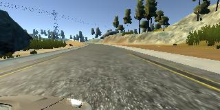

`
def flip_image()
def generate_flipped_data()
`

With the new data, the histogram now looks like this below.
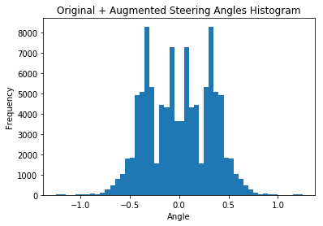

I finally randomly shuffled the data set and put 20% of the data into a validation set.

I used the remaining 80% training data for training the model. The validation set helped determine if the model was over or under fitting. Generally 10 epochs was more than enough where sometimes the best runs the training and validation mse was close to matching by 3-4 epochs. I used an adam optimizer so that manually training the learning rate wasn't necessary.

One last thing to mention is before convolving in the network, I cropped, resized and normalized (See below).
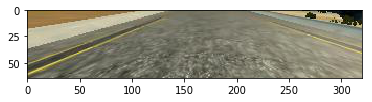
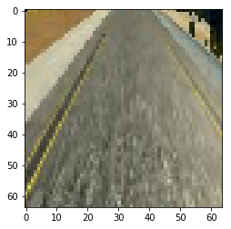
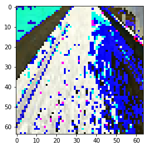

As already mentioned, this reduced the parameters and the complexity to process.

### Summary
Overall this was probably one of the most challenging projects I've worked on in a long time. This tied together many of the concepts and ideas taught in class. I also faced a learning curve on GitHub and AWS as well as really gaining more understanding of machine learning concepts and computer vision. Having taken other ML courses, this put it to the test and as you'll see in the video it's not perfect and definitely room for improvement, but I achieved what is expected for this project.

Ok, for some reason I can't figure out how to include video as I do like images.

